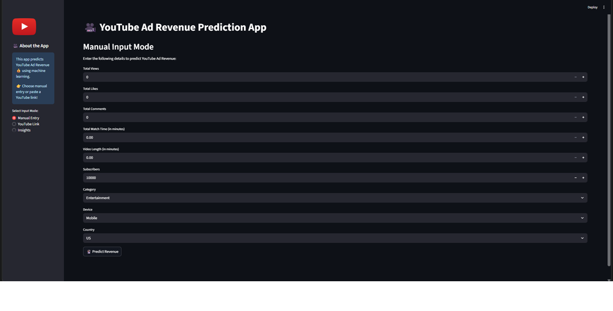

# Content-Monetization-Modeler---YouTube-Ad-Revenue-Prediction

A machine learning-powered web application to predict advertising revenue for YouTube videos. This tool leverages a trained Linear Regression model and the YouTube Data API to provide instant revenue estimates based on video performance metrics.

# 📋 Table of Contents

<ul>
  <li>Features</li>
  <li>Technology Stack</li>
  <li>Project Workflow</li>
  <li>Model Performance</li>
  <li>Installation & Setup</li>
  <li>Usage</li>
  <li>Project Structure</li>
</ul>

# ✨ Features

<ul>
  <li>Accurate Revenue Prediction: Utilizes a Linear Regression model with an R² score of ~0.95 to estimate ad revenue.</li>
  <li>Dual Prediction Modes</li>
  <ul>
    <li>Manual Input: Enter video statistics like views, likes, and comments directly.</li>
    <li>YouTube Link: Simply paste a YouTube video URL, and the app fetches the data automatically using the YouTube Data API.</li>
  </ul>
  <li>Real-time Data Fetching: Gathers up-to-date public statistics for any given YouTube video.</li>
  <li>Feature Engineering: Creates insightful features like engagement_rate and avg_watch_time_per_view to improve model accuracy.</li>
  <li>Interactive & User-Friendly UI: A clean and simple web interface built with Streamlit for seamless user interaction.</li>
</ul>

# 🛠️ Technology Stack

| Component | Technology |
|---|---|
| **Core Language** | `Python` |
| **Web Framework** | `Streamlit` |
| **Machine Learning** | `Scikit-learn`, `XGBoost` |
| **Data Handling** | `Pandas`, `NumPy`, `SciPy` |
| **API Integration** | `Google API Python Client` |
| **Data Visualization** | `Matplotlib`, `Seaborn` |
| **Model Persistence** | `Joblib` |
| **Development** | `Visual Studio Code`, `Jupyter Notebook` |

## 📈 Project Workflow

The project followed a structured machine learning pipeline:

1.  **Data Extraction & Understanding**: The initial dataset of ~122,000 YouTube video records was loaded. Key features included `Views`, `Likes`, `Comments`, `Category`, `Subscribers`, and the target variable `Ad Revenue`.

2.  **Data Cleaning & Preprocessing**:
    - Handled ~5% of missing values through appropriate imputation strategies.
    - Removed ~2% of duplicate entries to ensure data integrity.
    - Applied `OneHotEncoder` to categorical features (`Category`, `Device`, `Country`) and `StandardScaler` to numerical features to normalize their distributions.

3.  **Feature Engineering**: Two critical features were engineered to capture deeper engagement patterns:
    - **Engagement Rate**: `(Likes + Comments) / Views`
    - **Average Watch Time Per View**: `Watch Time (Minutes) / Views`

4.  **Exploratory Data Analysis (EDA)**: Visualizations revealed strong positive correlations between `Likes`, `Watch Time`, `Engagement Rate`, and the target `Ad Revenue`, confirming their importance for the model.

5.  **Model Building & Evaluation**: Five different regression models were trained and evaluated:
    - `LinearRegression`
    - `DecisionTreeRegressor`
    - `RandomForestRegressor`
    - `GradientBoostingRegressor`
    - `XGBRegressor`

    The **Linear Regression** model was selected as the final model due to its excellent performance and interpretability.

6.  **Deployment**: The trained model and preprocessing pipeline were saved using `joblib` and integrated into a Streamlit web application, providing a user-friendly interface for predictions.

## 🎯 Model Performance

The final Linear Regression model achieved the following performance on the test set:

| Metric | Score |
| :--- | :--- |
| **R-squared (R²)** | `0.953` |
| **Root Mean Squared Error (RMSE)** | `13.480` |
| **Mean Absolute Error (MAE)** | `3.111` |

An R² score of 0.953 indicates that the model can explain over 95% of the variance in YouTube Ad Revenue, making it highly reliable for predictions.

## Preview 

